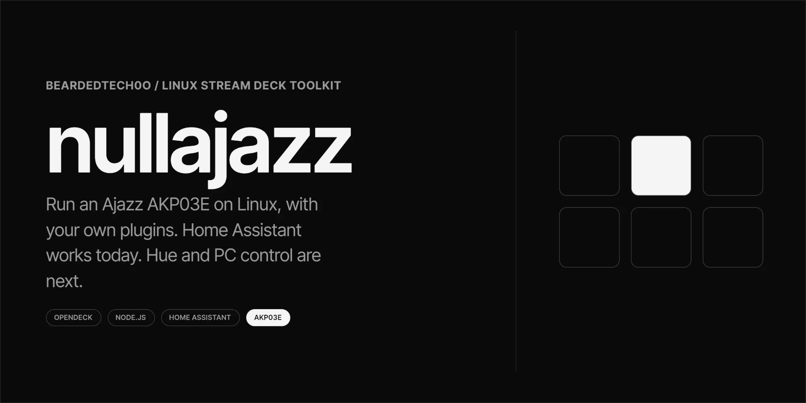

# nullajazz



Run an Ajazz AKP03E on Linux, with your own plugins. Home Assistant works today. Hue and PC control are next.

The deck itself is driven by [OpenDeck](https://github.com/nekename/OpenDeck) and the community
[AKP03 driver plugin](https://github.com/4ndv/opendeck-akp03). nullajazz adds the parts around them: an
installer that finds your deck, a small SDK for writing plugins, and plugins of its own. See
[`SECURITY.md`](./SECURITY.md).

Built with Node.js and Bash. Settings panels use the Nullobj design system.

## Features

One command setup, USB detection (no product ID lookup), udev rules for only the deck it finds, a dependency
free plugin SDK for Node 22+, a Home Assistant plugin (call any service, show entity state on the key), settings
panels in light and dark, safe helpers for plugin authors (no shell commands, capped and timed out requests,
key press guard), a dry run mode, and tests that need no hardware.

## Before you start

You need a Linux desktop with systemd (the USB rules rely on logind), `sudo`, `bash` 4 or newer, `curl` and `unzip`
(the download steps use them), and `zip` if you build packages with `scripts/package.sh`. Node.js 22 or newer is needed
to run the plugins in this repo. Check with `node --version`. If you use the Flatpak build of OpenDeck, confirm it can
see your system `node`, because I have not.

Nothing here has been tested on a real AKP03E yet. The code was checked against fakes and reviewed for security,
not run on the hardware. If something breaks on yours, the log paths under Troubleshooting will tell you where.

## Setup

### 1. Get the code

```bash
git clone https://github.com/BeardedTech0o/nullajazz.git && cd nullajazz
```

### 2. Look before you run

```bash
./install.sh --dry-run
```

This prints every step and changes nothing. You should see your deck named, for example
`Found Ajazz AKP03E rev. 2 (0300:3002)`. If it says no deck was detected, check the cable (it must carry data, not
just power) and try again.

### 3. Install

```bash
./install.sh
```

It asks before each step that changes your system.

1. **USB rules.** Detects the deck and installs a udev rule for that one device (uses `sudo`). Nobody needs to look
   up a product ID. No deck plugged in yet? `scripts/install-udev.sh --all` installs rules for every supported model.
2. **OpenDeck.** If it is missing, the script can fetch OpenDeck's own installer. That installer runs as you and may
   use `sudo`. In an interactive run it is saved to a file and you can read it before agreeing to run it. With
   `--run-opendeck-installer` it runs straight away.
3. **Driver plugin.** Shows the release tag and the exact download URL, then asks.
4. **Plugins in this repo.** Copies each one into OpenDeck's plugins folder, bundled with the SDK.

`--yes` (or `-y`) answers yes to the routine questions only. Steps that download and run someone else's code, or that
widen USB access to every supported model, are never approved by `--yes`. The first two need their own flags, so you
opt in on purpose:

```bash
./install.sh --yes --run-opendeck-installer --trust-latest-driver
```

Neither download is pinned or checksum verified, because there is no hash in this repo to check against. Use those
flags only if you trust the upstream projects. If no deck is detected, the offer to install rules for every model is
always asked at the keyboard, even with `--yes`. You can also skip any step with `--skip-udev`, `--skip-opendeck`,
`--skip-driver` or `--skip-plugins`, and `--help` lists everything.

If the driver step cannot find or download the release, it says so. Download the zip from the
[driver releases page](https://github.com/4ndv/opendeck-akp03/releases) and use OpenDeck, Plugins, Install from file.

### 4. Replug and restart

Unplug the deck, plug it back in, then start (or restart) OpenDeck. Your deck should appear in the device menu in
the top right. The plugins show up in the Plugins tab.

## Home Assistant

### Get a token

In Home Assistant, open your profile, then Security, then Long-lived access tokens, and create one. Copy it now.
Home Assistant shows it only once.

### Set up a key

1. In OpenDeck, find **Call Service** in the action list (the plugin is listed under Home Automation) and drag it onto a key.
2. Click the key to open its settings.
3. Under Connection, enter your base URL (for example `http://homeassistant.local:8123`, which is what a default install
   serves) and paste the token.
   These are shared by every Home Assistant key, so you do this once.
4. Under This key, fill in the service and the entity.

| Field | Example | Notes |
|---|---|---|
| Service | `light.toggle` | `domain.service`, lowercase letters, digits and underscores only, 100 characters at most |
| Entity ID | `light.desk` | Same format. Optional for the call, required for Show state. Find it in Settings, Devices and services, Entities. If set, it replaces any `entity_id` inside Extra data |
| Extra data | `{"brightness_pct": 50}` | Optional. Must be a JSON object, 2000 characters at most. Longer input is cut off and the call fails |
| Label | `Desk` | Optional, 40 characters at most |
| Show state | on | Polls Home Assistant every 5 seconds and shows the state on the key |

Press the key. OpenDeck shows its OK indicator when Home Assistant accepted the call, and its alert indicator when it
did not. The plugin log says why. A press that arrives while the previous one is still running, or within 300 ms of
it, is ignored and shows nothing.

With plain `http` the token crosses your network unencrypted. Use `https` if you have a valid certificate. A
self-signed certificate fails every call unless Node trusts it, for example by setting `NODE_EXTRA_CA_CERTS` to your
CA file in the environment OpenDeck runs in.

Keys can come from profiles other people give you. A key labelled "Desk" could call `lock.open` or
`homeassistant.restart` with your token. Check each imported key's service before you press it, and use a Home
Assistant token limited to what you need.

## Writing your own plugin

A plugin is a folder ending in `.sdPlugin` inside `plugins/`. It holds a `manifest.json`, a script, and optionally a
settings page. OpenDeck starts the script and talks to it over a local WebSocket using the Stream Deck plugin
protocol. Use `plugins/homeassistant.sdPlugin` as your reference.

```
plugins/
  _sdk/                      shared SDK and stylesheet, copied into every plugin at install time
  homeassistant.sdPlugin/
    manifest.json
    plugin.js
    pi.html                  settings panel (optional)
```

The SDK needs no `npm install`:

```js
const sdk = require('./_sdk/sdk');

sdk.connect({
  keyDown(ev, deck) {
    const s = sdk.settings(ev);            // untrusted settings, always a plain object
    deck.setTitle(ev.context, sdk.str(s.label, 40));
  },
});
```

Handlers you can define include `willAppear`, `willDisappear`, `keyDown`, `keyUp`, `didReceiveSettings` and
`didReceiveGlobalSettings`. Any event name OpenDeck sends can have a handler. The `deck` object can `setTitle`,
`setImage`, `setState`, `setSettings`, `getSettings`, `setGlobalSettings`, `getGlobalSettings`, `showOk`, `showAlert`,
`log` and `send` (raw messages), and exposes `uuid` and `info`.

Helpers that exist so you do not have to write the risky parts yourself:

| Helper | What it does |
|---|---|
| `sdk.settings(ev)` | Returns the action's settings as a plain object, or `{}` |
| `sdk.str(v, max)` | Returns a string capped at `max`, or `''` |
| `sdk.baseUrl(raw)` | Parses a URL, cuts it at 512 characters, drops query and fragment, strips trailing slashes. Allows only http and https, rejects embedded credentials, throws on bad input. It does not restrict the host |
| `sdk.fetchLimited(url, init, opts)` | Fetch with an 8 s timeout and a 1 MiB size cap by default. Rejects on any redirect. Returns `{ status, ok, text, json() }` |
| `sdk.run(file, args)` | Runs a program with an argument array and no shell. 10 s timeout, 1 MiB output cap, resolves with stdout |
| `sdk.guard(ms)` | Returns a function that runs a task per key. It returns `false` and skips the task if one is running, or if the last one finished less than `ms` ago |

Three rules. Settings travel inside shareable profiles, so treat them as untrusted input. Keep tokens in global
settings, never in per-key settings. Never build a shell string from settings: use `sdk.run`. That removes shell
injection only. If the program or its arguments come from settings, they are still attacker controlled, so allowlist
them.

Settings panels load `_sdk/nullobj.css` and use its `.field`, `.input`, `.btn` and `.section` classes, so every
plugin matches. After adding a plugin, run `./install.sh --skip-udev --skip-opendeck --skip-driver` to copy it into
OpenDeck, or build a zip with `./scripts/package.sh` and use OpenDeck, Plugins, Install from file.

## Configuration

`OPENDECK_CONFIG` (overrides where plugins are installed, defaults to `~/.config/opendeck`, or the Flatpak folder
if only the Flatpak app is installed). `XDG_CONFIG_HOME` is honoured if it is an absolute path. The udev rules
destination is fixed at `/etc/udev/rules.d/40-ajazz-deck.rules` and cannot be changed from the environment.

Test hooks, not for normal use: `AKP03_ZIP=/path/to/driver.zip` installs a local driver zip with no download and no
prompt, `SYSFS_USB` points detection at a fake device tree, and `NULLAJAZZ_ALLOW_ROOT=1` lets the installer run as
root.

## Updating

```bash
cd nullajazz && git pull && ./install.sh --skip-udev --skip-opendeck --skip-driver
```

That refreshes your plugins. Restart OpenDeck afterwards. To pick up a newer driver release, run the full
`./install.sh` again.

The udev step replaces the rules file each time. If you run it for a second deck, plug in both first, or use `--all`.

## Uninstalling

```bash
sudo rm -f /etc/udev/rules.d/40-ajazz-deck.rules && sudo udevadm control --reload-rules
rm -rf "${OPENDECK_CONFIG:-$HOME/.config/opendeck}/plugins/homeassistant.sdPlugin"
```

On Flatpak the plugins live in `~/.var/app/me.amankhanna.opendeck/config/opendeck/plugins/`. Remove the driver plugin
from OpenDeck's Plugins tab, or delete its folder under `plugins/`.

Uninstalling does not revoke your Home Assistant token, and OpenDeck may keep it in its settings. Delete the long
lived token in your Home Assistant profile, on the Security tab.

## Troubleshooting

**The deck does not appear in OpenDeck.** Replug it, then restart OpenDeck. Check that the rules file exists and the
deck is visible with `ls /dev/hidraw*`. USB access comes from `uaccess`, which needs a logged in systemd session. Over
plain SSH or without logind it will not apply.

**The installer finds no deck.** Use a data cable. Run `./scripts/install-udev.sh --dry-run` to see the detection on its
own. If it reports an unsupported ID starting with `0300`, open an issue with that ID and your model.

**Which revision do I have?** The AKP03E ships as `0300:1002` (original) or `0300:3002` (rev 2). According to the
driver library's notes, rev 2 also reports key release, which long press and push to talk would need. No plugin here
uses that yet.

**A key shows a red cross.** The service call failed. Check the base URL and token, and that the service and entity
exist. Per OpenDeck's docs, logs are in `~/.local/share/opendeck/logs/` (a different folder on Flatpak), with one file
per plugin under `plugins/`. I have not confirmed this on a running install.

**A key shows `?` instead of a state.** Home Assistant is unreachable, the entity ID is wrong, or the token is wrong
or missing.

**Plugins do not load.** Check `node --version` prints 22 or newer. Then restart OpenDeck.

**Plugins landed in the wrong folder.** On Flatpak the config lives under `~/.var/app/me.amankhanna.opendeck/`. Set
`OPENDECK_CONFIG` to the folder that contains `plugins/` and rerun.

## Development

```bash
node test/mock-opendeck.js        # fake OpenDeck and fake Home Assistant, runs the plugin end to end
test/install-udev.test.sh         # USB detection against a fake /sys
test/install.test.sh              # full installer against fakes (needs zip and python3)
./scripts/package.sh              # builds dist/*.zip for OpenDeck's Install from file
```

None of the tests touch your real `/etc` or your real OpenDeck folder.

## Roadmap

Done: USB detection, installer, plugin SDK, Home Assistant plugin, shared settings styling.

Planned: Philips Hue plugin, PC control plugin (volume, media, launch apps, run commands), knob support, pinned and
checksum verified driver downloads.

Not yet done: testing on a real AKP03E, and the font's license file (see `plugins/_sdk/fonts/NOTICE.md`).

[](https://www.buymeacoffee.com/nullobj)
